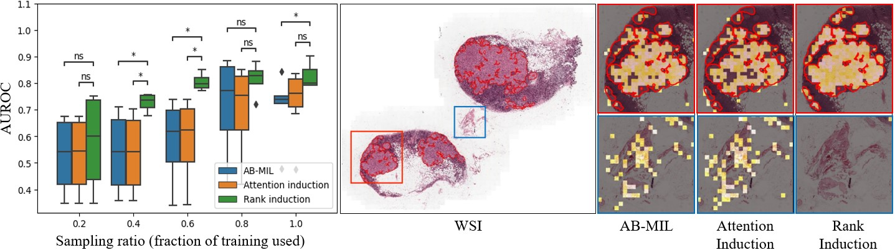

# Rank Induction for Multiple Instance Learning


Official repository for:
Kim et al., "Ranking-Aware Multiple Instance Learning for Histopathology Slide Classification" presented at the **Medical Imaging with Deep Learning (MIDL) 2025** conference.

## 🧠 Overview

**Rank Induction** is a training strategy for Multiple Instance Learning (MIL) that leverages expert annotations using a **ranking constraint**—rather than exact attention matching—to guide the model’s focus toward diagnostically meaningful areas.  By ranking annotated lesion patches higher than non-lesion patches, our method guides the model to focus on diagnostically meaningful regions without over-constraining attention distribution.

> ⚠️ Most MIL methods either ignore expert annotations or enforce overly strict attention constraints.  
> ✅ Our method strikes a balance by ranking annotated lesion patches higher than non-lesion ones—offering better interpretability and performance, especially in low-data regimes.



**Figure 1.** *Model performance under data scarcity and interpretation.*  Left: Performance at varying sampling ratios.  Middle: WSI thumbnail.   Right: Corresponding attention heatmap.

> As shown above, our method maintains stable performance across varying sampling ratios (left) and produces more accurate, interpretable attention maps (right). Red boxes highlight cancerous areas, while blue boxes indicate non-lesion regions.

---

## 🔬 Key iead

Most classic MIL methods only assume that the presence of at least one `positive` patch makes a slide positive, with no guidance on how *important* each patch is. In contrast, Rank Induction uses expert annotations (patches that are known to be lesion or non-lesion) to induce a pairwise *ranking* preference:

- **Lesion patches** should have **higher** attention scores than
- **Non-lesion patches**.

Formally, for lesion patches \( s_i \) and non-lesion patches \( s_j \), we want:
```math
s_i > s_j \quad \text{for all} \; (i, j) \;\text{where} \; y_i = 1, \; y_j = 0.
```
### Pairwise Probability

To implement this, we convert the **score difference** into a pairwise probability \( P_{i,j} \):

```math
    P_{i,j} \;=\; \frac{1}{1 + \exp\big[-\sigma ( s_i - s_j - m )\big]},
```

where
- $s_i$ and $s_j$ are the **raw** attention score (before softmax),
- $\sigma$ is a scaling factor,
- $m$ is a margin to encourage a significant gap between lesion and non-lesion attention scores.

### Rank Loss

We define the **Rank Loss** $\mathcal{L}_\mathrm{rank}$ by comparing the predicted pairwise probability \($P_{i,j}$\) against the ground-truth preference \($\bar{P}_{i,j} \in \{0,1\} $\) (which indicates which patch should be ranked higher):

```math
\mathcal{L}_{\text{rank}} 
    = \frac{1}{|\mathcal{P}|} \sum_{(i,j)\in \mathcal{P}}
    -\bar{P}_{i,j} \,\log P_{i,j} \;-\; \bigl(1 - \bar{P}_{i,j}\bigr)\,\log\bigl(1 - P_{i,j}\bigr),
```

where \($\mathcal{P}$\) contains all valid (lesion–non-lesion) patch index pairs.  
Finally, the **slide-level classification objective** (e.g., binary cross-entropy) and the rank loss are jointly optimized.

---


## 📊 Results

### Camelyon16

| Method              | AUROC         | AUPRC         |
|---------------------|---------------|---------------|
| AB-MIL              | 0.740 ± 0.146 | 0.730 ± 0.183 |
| Attention Induction | 0.743 ± 0.142 | 0.727 ± 0.179 |
| **Rank Induction**  | **0.836 ± 0.044** | **0.851 ± 0.036** |

### DigestPath

| Method              | AUROC         | AUPRC         |
|---------------------|---------------|---------------|
| AB-MIL              | 0.992 ± 0.002 | 0.989 ± 0.004 |
| Attention Induction | 0.993 ± 0.002 | 0.990 ± 0.003 |
| **Rank Induction**  | **0.995 ± 0.001** | **0.993 ± 0.002** |

> 🧪 **Reproducibility**  
To reproduce the above results, please refer to the Jupyter notebook provided in:
```
result/
├── 0_loss.ipynb
├── 1_performance.ipynb
├── 2_posthoc.ipynb
├── 3_data_scarcity.ipynb
├── 4_granularity.ipynb
└── 5_digestpath.ipynb
```

## 👨‍🔬 Authors

| Name              | ORCID                            | Email                               | Affiliation                                   | Notes                 |
|-------------------|----------------------------------|-------------------------------------|-----------------------------------------------|------------------------|
| **Ho Heon Kim**   | [0000-0001-7260-7504](https://orcid.org/0000-0001-7260-7504) | hoheon0509@mf.seegene.com          | $^{1}$ AI Research Center, Seegene Medical Foundation | *Contributed equally* |
| **Gisu Hwang**    | [0000-0003-1046-9286](https://orcid.org/0000-0003-1046-9286) | gshwang@mf.seegene.com             | $^{1}$ AI Research Center, Seegene Medical Foundation | *Contributed equally*|
| **Won Chang Jeong** | [0009-0008-1931-5957](https://orcid.org/0009-0008-1931-5957) | jeongwonchan53@mf.seegene.com      | $^{1}$ AI Research Center, Seegene Medical Foundation |                      |
| **YoungSin Ko**   | [0000-0003-1319-4847](https://orcid.org/0000-0003-1319-4847) | noteasy@mf.seegene.com             | $^{1,2}$ AI Research Center / Pathology Center, Seegene Medical Foundation | *Corresponding author* |

### 📍 Affiliations

- $^{1}$ AI Research Center, Seegene Medical Foundation, 320 Cheonho-daero, Seoul, South Korea  
- $^{2}$ Pathology Center, Seegene Medical Foundation, 320 Cheonho-daero, Seoul, South Korea